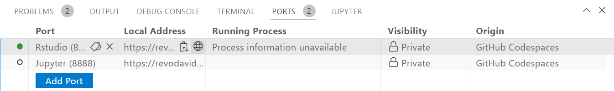

# Zero-setup R workshops with GitHub Codespaces

This is the repository supporting the presentation "Zero-setup R workshops with GitHub Codespaces".

* Presenter: [David Smith](https://www.linkedin.com/in/dmsmith/), Cloud Advocate at Microsoft
* Presented at: [rstudio::conf, July 28 2022](https://rstudioconf2022.sched.com/event/11iag/zero-setup-r-workshops-with-github-codespaces) 
* Presentation slides: [Pending](Pending)
* Presentation video: [Pending](Pending)

You can recreate the demos in the talk using the steps outlined below.

## Dev Containers in GitHub Codepaces

If you have access to GitHub CodeSpaces, click the green "<> Code" button at the top right on this repository page, and then select "Create codespace on main". (GitHub CodeSpaces is available with [GitHub Enterprise](https://github.com/enterprise) and [GitHub Education](https://education.github.com/).)

Now, browse to the file [explore-analyze-data-with-R/solution/challenge-Data_Exploration.ipynb](explore-analyze-data-with-R/solution/challenge-Data_Exploration.ipynb). Work through the Jupyter Notebook.

To open RStudio Server, click the Forwarded Ports "Radio" icon at the bottom of the VS Code Online window.

In the Ports tab, click the Open in Browser "World" icon that appears when you hover in the "Local Address" column for the Rstudio row.

This will launch RStudio Server in a new window. Log in with the username and password `rstudio/rstudio`. 

* NOTE: Sometimes, the RStudio window may fail to open with a timeout error. If this happens, try again, or restart the Codepace.

In RStudio, use the File menu to open the `/workspaces`, folder and then browse to open the file `devcontainers-rstudio` / `explore-analyze-data-with-R` / `solution` /  `all-systems-check` / `test.Rmd`. Use the "Knit" submenu to "Knit as HTML" and view the rendered "R Notebook" Markdown document.

* Note: You may be prompted to install an updated version of the `markdown` package. Select "Yes".

# Resources and Links

* [GitHub Codespaces](https://github.com/features/codespaces) - Available with GitHub Enterprise and GitHub Education
* [Microsoft Workshop Library](https://github.com/microsoft/workshop-library) - The source of the workshop "Explore and analyze data with R" included in this presentation
* [Rocker](https://www.rocker-project.org/) - Containers for R 
* [Dev Containers](https://containers.dev/) - Overview and specification
* [Dev Containers in Visual Studio Code](https://marketplace.visualstudio.com/items?itemName=ms-vscode-remote.remote-containers) - Remote-Containers extension 
* [Visual Studio Code](https://code.visualstudio.com/) - Free editor available for Windows, Mac and Linux
* Related talk: [Easy R Tutorials with Dev Containers](https://github.com/revodavid/devcontainers-r). This talk provides information on running Dev Containers in a local environment with Visual Studio Code.
# Thanks to

* えいつぴ (@[eitsupi](https://twitter.com/eitsupi)): For [helpful info on using RStudio in a Rocker container](https://www.rocker-project.org/images/versioned/rstudio)
* Eric Nantz ([R-Podcast](https://r-podcast.org/)): For the episode "[Fully containerized R dev environment with Docker, RStudio, and VS-Code](https://www.youtube.com/watch?v=4wRiPG9LM3o)"

## Image Credits

Images used in presentation slides:
* [File:A frustrated and depressed man holds his head in his hand.jpg - Wikimedia Commons](https://commons.wikimedia.org/wiki/File:A_frustrated_and_depressed_man_holds_his_head_in_his_hand.jpg)
* [File:Confused Felipe.jpg - Wikimedia Commons](https://commons.wikimedia.org/wiki/File:Confused_Felipe.jpg)
* [File:Woman looking depressed.jpg - Wikimedia Commons](https://commons.wikimedia.org/wiki/File:Woman_looking_depressed.jpg)
* [File:Angry woman.jpg - Wikimedia Commons](https://commons.wikimedia.org/wiki/File:Angry_woman.jpg)
* "Bit" artwork by Ashley Willis

# Feedback

If you have any comments or suggestions about this presentation, please leave an issue in this repository.